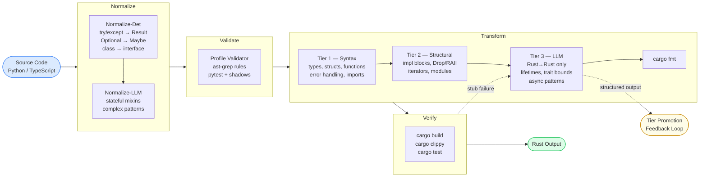

  

  <strong>Semantic Profile-Guided Code Generation</strong> 
  Write reviewable Python or TypeScript. Ship production Rust.

  Powering <strong>Ferrum EDM</strong> (compiled data pipelines) and <strong>Sinter</strong> (compiled workflow automation)

## Repositories

### Translation Pipelines

| Repository | Description | Status |
|-----------|-------------|--------|
| [`python-to-rust`](https://github.com/refactory-lang/python-to-rust) | Python → Rust translation pipeline (8-step: normalize → validate → T1 → T2 → T3 → format → verify) | Phase 1 |
| [`typescript-to-rust`](https://github.com/refactory-lang/typescript-to-rust) | TypeScript → Rust translation pipeline | Phase 1 |
| [`core`](https://github.com/refactory-lang/core) | Shared transform utilities + Tier 3 Rust→Rust resolve (`@refactory/core`) | Phase 1 |
| [`rust-ir`](https://github.com/refactory-lang/rust-ir) | Typed Rust IR builder for JSSG transforms — grammar-faithful, render-then-validate | Phase 1 |

### Shadow Libraries

| Repository | Description | Status |
|-----------|-------------|--------|
| [`shadows-python`](https://github.com/refactory-lang/shadows-python) | 19 PyO3/maturin crates (Cargo workspace) + import hook — API-identical Python wrappers around Rust crates | Phase 0.5 |
| [`shadows-ts`](https://github.com/refactory-lang/shadows-ts) | TypeScript shadow libraries (napi-rs) | Phase 1 |
| [`sinter-n8n-helpers`](https://github.com/refactory-lang/sinter-n8n-helpers) | n8n IExecuteFunctions shadow — maps ~30-40 n8n helpers to Sinter equivalents | Phase 1 |

### Product SDKs

| Repository | Description | Status |
|-----------|-------------|--------|
| [`ferrum-sdk`](https://github.com/refactory-lang/ferrum-sdk) | Ferrum Python Component SDK — validate → test → translate → compile | Phase 2 |
| [`sinter-sdk`](https://github.com/refactory-lang/sinter-sdk) | Sinter Step SDKs (Python + TypeScript) — workflow step protocol | Phase 2 |

### Shared

| Repository | Description |
|-----------|-------------|
| [`refactory-template`](https://github.com/refactory-lang/refactory-template) | Common config template (speckit, Claude/agents, MCP) for all repos |

## Pipeline Architecture

## How It Works

1. **Profile** — A strict subset of the source language (e.g. "Python-as-Rust", "TypeScript-as-Rust") that makes code structurally translatable. Enforced by ast-grep rules.
2. **Normalize-Det** — Deterministic rewrites: idiomatic patterns → profile-compliant forms (`try/except` → `Result`, `throw` → `Err`, etc.)
3. **Normalize-LLM** — LLM-assisted normalization for patterns too complex for deterministic rules (class → readonly interface, complex control flow)
4. **Validate** — ast-grep profile validator confirms all code is profile-compliant before translation
5. **Transform T1/T2** — Deterministic AST transforms via JSSG (T1: types/structs/syntax, T2: modules/control/generators)
6. **Transform T3** — LLM-assisted Rust→Rust pass for constructs with no Python/TS representation (lifetimes, trait bounds, async patterns). Resolves `todo!("t3:*")` stubs.
7. **Verify** — `cargo build`, `cargo clippy`, `cargo test` on the formatted output

## Tier Promotion

The **Tier Promotion Feedback Loop** continuously shrinks the LLM-dependent surface: T3 structured outputs are clustered by AST fingerprint, candidate JSSG rules are generated, validated through CI, and surfaced as PRs. Approved rules become permanent T1/T2 transforms.

## Terminology

| Term | Meaning |
|:-----|:--------|
| **Phase** (0–4) | Project timeline milestone |
| **Track** (A/B/C) | Parallel work stream within a Phase |
| **Tier** (1/2/3) | Translation pipeline stage |
| **Priority** (A–D) | Shadow library implementation order |

## License

Apache-2.0
