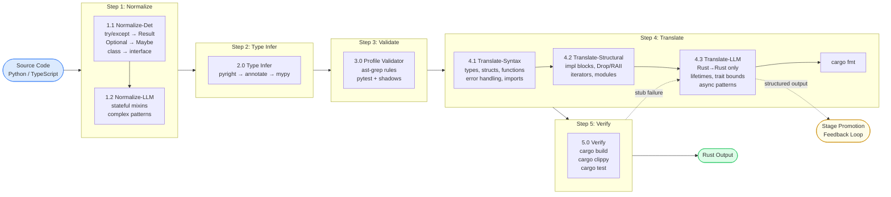

  

  <strong>Semantic Profile-Guided Code Generation</strong> 
  Write reviewable Python or TypeScript. Ship production Rust.

  Powering <strong>Ferrum EDM</strong> (compiled data pipelines) and <strong>Sinter</strong> (compiled workflow automation)

## Repositories

### Transformation Pipeline

| Repository | Description | Status |
|-----------|-------------|--------|
| [`python-to-rust`](https://github.com/refactory-lang/python-to-rust) | Python → Rust transformation pipeline (5-step: normalize → type-infer → validate → translate → verify) | Milestone 1 |
| [`typescript-to-rust`](https://github.com/refactory-lang/typescript-to-rust) | TypeScript → Rust transformation pipeline | Milestone 1 |
| [`core`](https://github.com/refactory-lang/core) | Shared utilities + Stage 3 Rust→Rust resolve (`@refactory/core`) | Milestone 1 |
| [`rust-ir`](https://github.com/refactory-lang/rust-ir) | Typed Rust IR builder for JSSG transforms — grammar-faithful, render-then-validate | Milestone 1 |
| [`grammar-types`](https://github.com/refactory-lang/grammar-types) | Language-agnostic type projection from tree-sitter grammars to typed IR builders | Milestone 1 |
| [`ir-codegen`](https://github.com/refactory-lang/ir-codegen) | Code generator — reads tree-sitter grammars, generates builder factories + renderers + tests | Milestone 1 |
| [`python-annotate`](https://github.com/refactory-lang/python-annotate) | Step 2 Type Infer CLI — pyright → annotate → mypy --strict (Python-specific) | Milestone 1 |

### Shadow Libraries

| Repository | Description | Status |
|-----------|-------------|--------|
| [`shadows-python`](https://github.com/refactory-lang/shadows-python) | 19 PyO3/maturin crates (Cargo workspace) + import hook — API-identical Python wrappers around Rust crates | Milestone 0.5 |
| [`shadows-ts`](https://github.com/refactory-lang/shadows-ts) | TypeScript shadow libraries (napi-rs) | Milestone 1 |
| [`sinter-n8n-helpers`](https://github.com/refactory-lang/sinter-n8n-helpers) | n8n IExecuteFunctions shadow — maps ~30-40 n8n helpers to Sinter equivalents | Milestone 1 |

### Product SDKs

| Repository | Description | Status |
|-----------|-------------|--------|
| [`ferrum-sdk`](https://github.com/refactory-lang/ferrum-sdk) | Ferrum Python Component SDK — validate → test → translate → compile | Milestone 2 |
| [`sinter-sdk`](https://github.com/refactory-lang/sinter-sdk) | Sinter Step SDKs (Python + TypeScript) — workflow step protocol | Milestone 2 |

### Shared

| Repository | Description |
|-----------|-------------|
| [`refactory-template`](https://github.com/refactory-lang/refactory-template) | Common config template (speckit, Claude/agents, MCP) for all repos |
| [`config-typescript`](https://github.com/refactory-lang/config-typescript) | Shared TypeScript toolchain config — tsconfig, oxlint, oxfmt base configs |
| [`config-python`](https://github.com/refactory-lang/config-python) | Shared Python toolchain config — ruff, mypy, pytest conventions |
| [`config-rust`](https://github.com/refactory-lang/config-rust) | Shared Rust toolchain config — rustfmt, clippy, Cargo workspace conventions |

## Pipeline Architecture

The transformation pipeline has 5 canonical steps, with stages within each:

## How It Works

1. **Step 1: Normalize** — Rewrite idiomatic source to profile-compliant form
   - **1.1 Normalize-Det** — Deterministic rewrites (`try/except` → `Result`, `throw` → `Err`, etc.)
   - **1.2 Normalize-LLM** — LLM-assisted normalization for complex patterns (class → readonly interface)
2. **Step 2: Type Infer** — Run `pyright` → `refactory-annotate` → `mypy --strict` to ensure full type coverage before validation
3. **Step 3: Validate** — ast-grep profile validator confirms all code is profile-compliant before translation
4. **Step 4: Translate** — Convert profile-compliant source to Rust
   - **4.1 Translate-Syntax** — Deterministic syntax mapping via JSSG (types, structs, functions, imports)
   - **4.2 Translate-Structural** — Structural transforms (impl blocks, Drop/RAII, iterators, modules)
   - **4.3 Translate-LLM** — LLM-assisted Rust→Rust pass for constructs with no source representation (lifetimes, trait bounds, async). Resolves `todo!("s3:*")` stubs.
5. **Step 5: Verify** — `cargo build`, `cargo clippy`, `cargo test` on the formatted output

## Stage Promotion

The **Stage Promotion Feedback Loop** continuously shrinks the LLM-dependent surface: Stage 3 structured outputs are clustered by AST fingerprint, candidate JSSG rules are generated, validated through CI, and surfaced as PRs. Approved rules become permanent Stage 1/2 transforms.

## Terminology

| Term | Meaning | Example |
|:-----|:--------|:--------|
| **Milestone** (0–4) | Project timeline milestone | Milestone 1: Multi-Language Foundation |
| **Track** (A/B/C) | Parallel work stream within a Milestone | Milestone 1 Track A: Python |
| **Step** (1–5) | Pipeline step | Step 4: Translate |
| **Stage** (1/2/3) | Sub-step within Translate | Stage 1 (Step 4.1): Syntax |
| **Priority** (A–D) | Shadow library implementation order | Priority A: Core shadows |

## License

Apache-2.0
